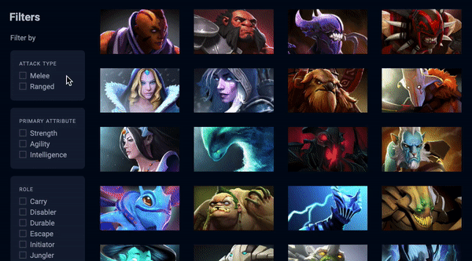

# Dota-SPA


The app I am building is a Dota Heroes explorer. It lets you filter Dota’s heroes according to three categories:
Attack Type
Primary Attribute
Role

You can treat this application like an e-commerce platform where you can filter search results by specific attributes.
## General Info
Dota has an API. It’s called Open Dota API. You can find the documentation [here](https://docs.opendota.com/ "here"). I will use this API to get information about heroes. 
I create a minimum viable server with Node and Express capable of serving the same index.html file regardless of the link the user visited.
I build this Single Page Application with a framework called Tine that I created with Vanilla Js
  

## Technologies
A list of technologies used within the project:
- HTML
- CSS
- JavaScript
- Node
- Express.js (framework)
- Nodemon
- Tiny (A framework that I created)
- ZlFetch (Library)

## Installation
A little intro about the installation. 
```
$ git clone git@github.com:santtier/Dota-SPA.git
$ cd Dota-SPA
npm install
npm run server
```
Once you run this command, you must go to http://localhost:3000 to view the app.

## Collaboration
Give instructions on how to collaborate with your project.
There are a set of rules to keep in mind:

- Perform work in a feature branch.
  _Why:_
  > Because this way all work is done in isolation on a dedicated branch rather than the main branch. It allows you to submit multiple pull requests without confusion. You can iterate without polluting the master branch with potentially unstable, unfinished code. [read more...](https://www.atlassian.com/git/tutorials/comparing-workflows#feature-branch-workflow)
- Branch out from `main`

  _Why:_

  > This way, you can make sure that code in master will almost always build without problems, and can be mostly used directly for releases (this might be overkill for some projects).

- Never push into `main` branch. Make a Pull Request.

  _Why:_

  > It notifies team members that they have completed a feature. It also enables easy peer-review of the code and dedicates forum for discussing the proposed feature.

- Delete local and remote feature branches after merging.
  _Why:_
  > It will clutter up your list of branches with dead branches. It ensures you only ever merge the branch back into (`main`) once. Feature branches should only exist while the work is still in progress.

- Comment your code. Try to make it as clear as possible.
- Don't use comments as an excuse for a bad code. Keep your code clean.
- Don't use clean code as an excuse to not comment at all.
- Keep comments relevant as your code evolves.
- Recommended using [JSDoc](https://www.youtube.com/watch?v=r0H-acWQS6c)

## Demo
If you want to see the demo of this proyect deployed, you can visit [Dota-SPA](https://dota-spa.herokuapp.com/ "Dota-SPA")

